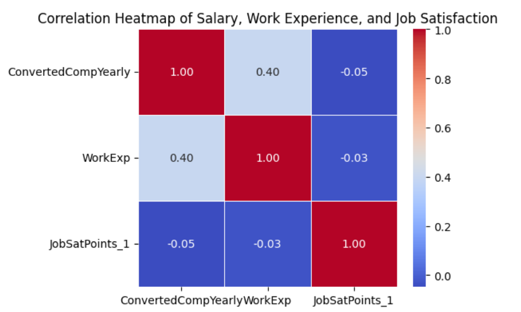

# Global Developer Compensation Correlation Analysis

This project analyzes global developer compensation using the Stack Overflow Developer Survey to examine how salary relates to professional experience and job satisfaction.

The project demonstrates data cleaning, outlier handling, correlation analysis, and visualization using Python.

---

## Dataset

Source: Stack Overflow Developer Survey  
https://cf-courses-data.s3.us.cloud-object-storage.appdomain.cloud/n01PQ9pSmiRX6520flujwQ/survey-data.csv  

The dataset is loaded directly via URL to ensure full reproducibility.

---

## Objectives

- Visualize salary distributions  
- Remove extreme salary outliers  
- Analyze correlations between salary, work experience, and job satisfaction  
- Compare compensation distributions across major countries  
- Identify whether higher pay correlates with higher satisfaction  

---

## Visualizations

| Analysis | Preview |
|--------|--------|
| Salary Distribution |  |
| Salary by Country (Top 10) |  |
| Correlation Heatmap |  |
| Salary vs Work Experience |  |
| Salary vs Job Satisfaction |  |

---

## Tech Stack

- Python  
- Pandas  
- Matplotlib  
- Seaborn  

---

## Author
  contributors:
    - Rav Ahuja
    - Lakshmi Holla
    - Malika

Analysis_by: William Quinby
Data Analyst | Python | SQL | Visualization
  contributors:
    - Rav Ahuja
    - Lakshmi Holla
    - Malika
